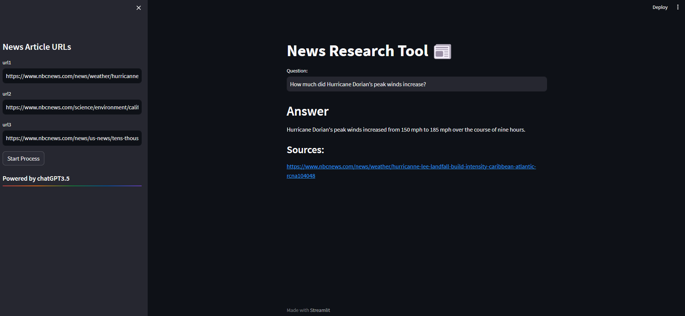

# NewsResearchTool


 this app allows you to ask questions about news articles and get comprehensive answers based on the information in the articles. The app uses a combination of cutting-edge technologies, including Streamlit, LangChain, sentence-transformers as a embedding model, and ChatGPT3.5 as a LLM to deliver accurate and informative answers.

To use the app, simply add three news URLs and then ask your question. The app will then retrieve the articles from the web, extract the relevant information, and generate an answer using ChatGPT3.5. The answers are generated in a comprehensive and informative way, even if the questions are open ended, challenging, or strange.





## Deployment

To deploy this project run

1:
```bash
  git clone https://github.com/AminHaghdadi/NewsResearchTool.git
```
2: install requirements:
```bash
  pip install -r requirement.txt 
```
3:

Enter your OpenAI API in keys.py 

5: Run in Terminal
```bash
streamlit run app.py
```
